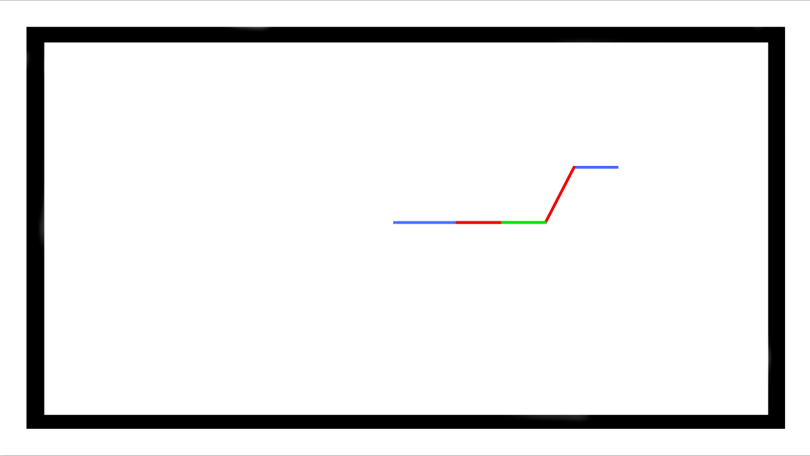
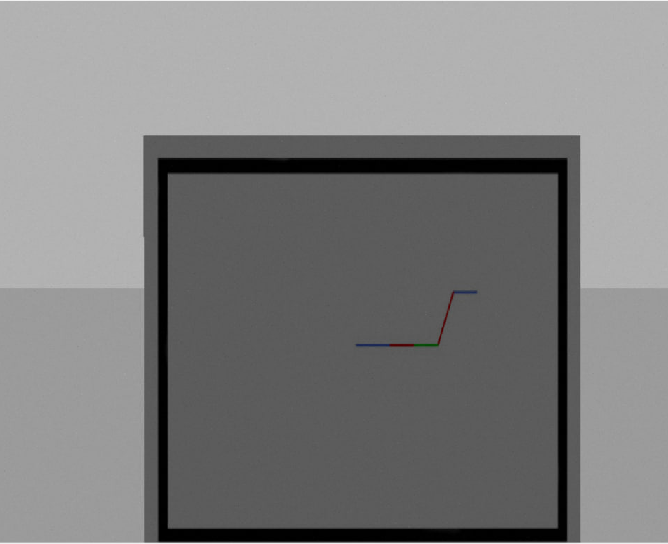
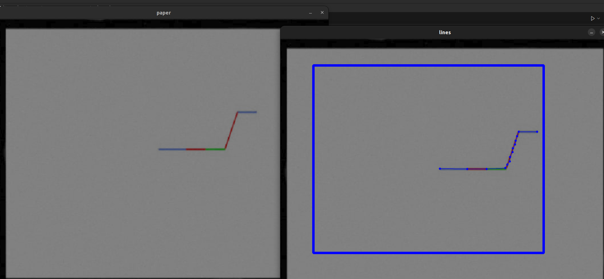

# ARL-project
 The goal of this project is to develop a drone control system that enables precise and autonomous navigation along a predefined trajectory drawn on a physical piece of paper. Using computer vision and ROS, the system will interpret the trajectory markings which are assumed to be red, green and blue lines on a field marked with black outline, allowing the drone to follow the designated path within a defined coordinate system. This solution aims to bridge the gap between manual input and automated drone navigation, showcasing the potential for intuitive and user-friendly control interfaces in the field of unmanned aerial vehicles.
## Enviroment setup 

In the physical environment, we use DJJ Tello EDU drone with motion capture system Optitrack in PUT laboratory and a computer with code commited on this repo. 
The computer is connected to the drone through it's WIFI and Optitrack coordinates are sent to ROS navigation package by ethernet cable with static IP protocol. 

For the virtual enviroment and simulation, we use a docker container with Gazebo and ROS2 Foxy on Ubuntu 20.04. Dockerfile and docker-compose files are available in the `docker` folder. 

The `src/` directory contains our code for drone's navigation and machine vision as well as a tello_ros package from https://github.com/clydemcqueen/tello_ros used as a driver, communication and simulation purposes. 

### Docker container

To setup the docker container go into `docker/` directory and type into the terminal

	`docker compose up` 

### Python 

Install python packages in your docker: 

```
sudo apt-get install ros-(DISTRO)-cv-bridge
```
```
pip install -r requirements.txt
```

## Scope of work 

Intended scope of work is to implement
* a **navigation system** that 
  * is based on potential vector fields with position and orientation feedback from Optitrack 
  * receives one trajectory from the machine vision system and processes it
  * effectively calculates the difference in values ​​and, based on this, computes the vector field
  * observes the robot's position and sends a control signal based on the feedback

* a **machine vision system** that 
  * will recognise a piece of paper and the flying zone marked with black outline 
  * recognise the trajectory lines, where the colors of the line are indicators for the z axis 
  * convert the lines to 3D trajectory points within the physical bounds of the flying zone in the lab  
  * send them to navigation

Navigation realised by Maja Zelmanowska. 
Machine vision realised by Anna Nasierowska. We both helped each other and had to integrate our scripts, so it's not completely separate work. 

## Realization 

We realised most of the intended workload, but for simple cases and some initial conditions required. 

First of all, all the code is for ROS2. We communicate with drone through ROS2 nodes in two packages - navigation and camsub. 

## Vision 

**Camsub** is a python package with a subscriber that listens to the camera image from the drone, which is under the `image_raw` topic. It takes each frame and checks for the piece of paper with the flying zone marked using opencv and opencv bridge for converting the image to a numpy array. 

### Finding the paper 

Finding the paper in the image is done by extracting edges from the frame with Canny algorithm, finding their contours and approximating the best matching rectangle with cv2.PolyDP. 

### Lines and trajectory

For the navigation system we used, what is needed to be obtained from the picture is a list of points for the drone to achieve. For the trajectory to be accurate, we need to know each point in space where the direction of movement changes in any axis, so the minimum is a point where each line begins and ends and a color of each line. 

For that purpose, the algoritm of Shi-Tomasi for corner detection is used. It's a good choice, because it is based on finding a siginificant change in each image direction and returning points, which is exactly what we want. Also after testing out a few options, we find it more robust to image noise and easier to parametrize for our usecase. It's more effective in comparison to other feature extractions like edge detection, finding lines using Hough detector, morphologies or color filtering. 

The algorithm is implemented in opencv as `cv2.goodFeaturesToTrack()` function and can be adjusted by giving a maximum amount of points to detect, required quality of points and a minimum distance between them. 

However obtaining the points isn't enough for a trajectory. The coordinates must be in a proper order and of known color. 
That's where the initial conditions and simplification comes in. 
For simplification, the initial condition is that a starting point is the one that is closest to center and the distance from center is what the points are sorted by. 

For color recognition, the value of the hue channel is thresholded in HSV in the corner pixel. Another simplification is that only 3 colors are considered, red, green and blue. A simple function with ifs that assigns 0.5, 1.0 and 1.5m depending on the color. 

### Using the trajectory for navigation 

The points are published in 3 lists - one for each axis, under topic `poses3d` in messages of type `PoseArray`. 

### Results 

This is a drawing of an exemplary trajectory that can be printed: 

This is the drawing imported to gazebo, viewed through the **simulated** drone on rviz: 

And this is the resulting trajectory drawn on the camera image: 


Published message: 

```
[cam_subscriber-1] [INFO] [1706470355.335800852] [image_subscriber]: Publishing path : geometry_msgs.msg.PoseArray(header=std_msgs.msg.Header(stamp=builtin_interfaces.msg.Time(sec=0, nanosec=0), frame_id=''), poses=[geometry_msgs.msg.Pose(position=geometry_msgs.msg.Point(x=-0.040625, y=-0.061111111111111116, z=1.5), orientation=geometry_msgs.msg.Quaternion(x=0.0, y=0.0, z=0.0, w=1.0)), geometry_msgs.msg.Pose(position=geometry_msgs.msg.Point(x=0.1875, y=-0.061111111111111116, z=0.5), orientation=geometry_msgs.msg.Quaternion(x=0.0, y=0.0, z=0.0, w=1.0)), geometry_msgs.msg.Pose(position=geometry_msgs.msg.Point(x=0.35000000000000003, y=-0.061111111111111116, z=0.5), orientation=geometry_msgs.msg.Quaternion(x=0.0, y=0.0, z=0.0, w=1.0)), geometry_msgs.msg.Pose(position=geometry_msgs.msg.Point(x=0.509375, y=-0.07222222222222223, z=1.0), orientation=geometry_msgs.msg.Quaternion(x=0.0, y=0.0, z=0.0, w=1.0)), geometry_msgs.msg.Pose(position=geometry_msgs.msg.Point(x=0.625, y=-0.5444444444444445, z=1.0), orientation=geometry_msgs.msg.Quaternion(x=0.0, y=0.0, z=0.0, w=1.0)), geometry_msgs.msg.Pose(position=geometry_msgs.msg.Point(x=0.7781250000000001, y=-0.55, z=1.5), orientation=geometry_msgs.msg.Quaternion(x=0.0, y=0.0, z=0.0, w=1.0))])
```
As you can see in the pictures and the message, with the **quality of the simulated drone camera** which doesn't cause issues related to framerate, noise and registered color saturation, **the colors are recoginized** and transformed into Z coordinates accordingly.

## Navigation 

### VFO

Vector Field Orientation (VFO) for drone control is a sophisticated method of navigating and controlling drones using a vector field approach. This technique involves creating a virtual field of vectors, where each vector represents a direction and magnitude of force. The drone navigates by aligning itself with these vectors. The system creates a virtual field around the drone, with vectors indicating the direction and strength of the desired movement. This field dynamically adjusts based on the drone's current position, destination, and any obstacles in its path. As the drone moves, the vector field updates in real-time. This allows for smooth navigation around obstacles and efficient pathfinding towards the destination. Vector Field Orientation provides a highly effective and efficient way to control drones, especially in applications requiring high precision and adaptability.

### Control 

To control the drone in simulation we used a topic connected to the gazebo ` /drone1/cmd_vel` , which is sent at a frequency of 10Hz. For the real drone control, you have to change the value of the bool "simulation" variable to false and then the node sends request to the `/tello_action` service with the control velocity. 

### Results 

In simulation, the drone reaches the trajectory points that was sent to it by **camsub** in all 3 coordinates. 

View from top to see the x and y coordinates clearly: https://drive.google.com/file/d/1jdaslfaNUraJbmPx87iqL_ku00ukcpt-/view?usp=sharing

View from the side to see the movement in Z: https://drive.google.com/file/d/1YaNzkGx1QRBJ2it91UxRtMOOUcMzVdCi/view?usp=sharing

The trajectory is achieved, but it's mirrored in y axis and rotated by 90 degrees regarding the camera image coordinates. 

## Usage 

To be able to control the drone through the navigation package and view the camera view from the drone, you need to run teleop.
```
ros2 launch tello_driver teleop_launch.py
```

To see the path that was found from the drone camera, turn on **camsub** in the setup docker.


```
ros2 launch camsub camsub.launch.py
```

When you see that the paper shown to the drone is in frame and the trajectory found is satisfying, press 'q' in the window with the path drawn to send the trajectory to navigation package. 

To run navigation: 
```
ros2 launch navigation navigation.launch.py
```

If everything is up and running, the drone should starting to move after pressing 'q'. 

## Possible project expansion and improvement

### Vision 
* add a nearest neighbour point sorting 
* add a starting point recognition - possibly a mark on the paper, like a dot or a cross 
* trajectory orientation recognition - currently the trajectory will be read depending on the way you hold the paper to the camera

### Navigation 

* Ensure that PID tuning instructions are well-documented, including the purpose of PID controllers in the project, the parameters involved, and their effects.
* Provide sample PID configurations and explain their use cases.
* Better use of computational resources and faster and more effective transfer of variables.

### Credits

The packages 

* `tello_driver`
* `tello_msgs`
* `tello_description`
* `tello_gazebo` 

are from 

authors:
- family-names: "McQueen"
  given-names: "Clyde"
  orcid: "https://orcid.org/0009-0007-9179-318X"
authors:
- family-names: "Mullen"
  given-names: "Peter"
  orcid: "https://orcid.org/0009-0000-7266-8913"
title: "Tello ROS"
version: 0.1.0
date-released: 2019-1-19
url: "https://github.com/clydemcqueen/tello_ros"

